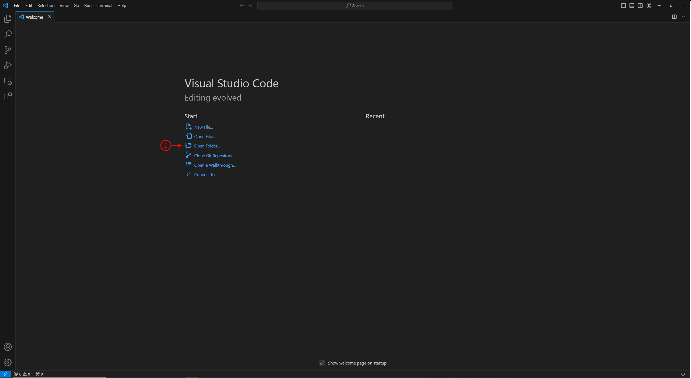
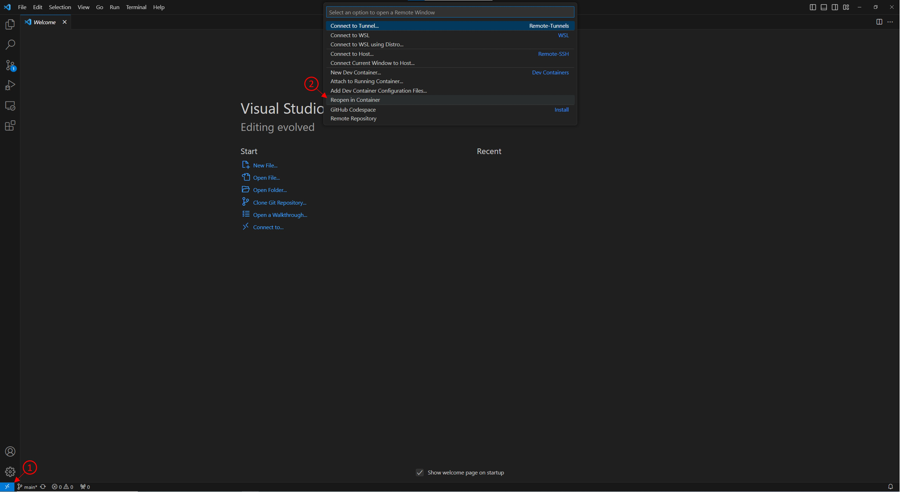

# Artificial Intelligence in Automotive Technology
This is the Github repository of the TUM course on "[Artificial Intelligence in Automotive Technology](https://www.mos.ed.tum.de/en/ftm/teaching/courses/kuenstliche-intelligenz-in-der-fahrzeugtechnik/)" from the Institute of Automotive Technology of the Technical University of Munich.

In this repository, we will upload the practice session material that belongs to each of the lectures that will teach you the foundations of Artificial Intelligence with regard to its use in automotive technology. Besides the lecture material that you can find on our main course website, we will upload coding examples, which we are using in the practice session of each lecture.

## Prerequisites
To work with the provided materials, please make sure that your system fulfills the following requirements and install them accordingly.

Basic requirements:
- Operating System: Windows 10/11, macOS or Linux
- Version Control: Git (for [Windows](https://www.atlassian.com/git/tutorials/install-git#windows), [macOS](https://www.atlassian.com/git/tutorials/install-git#mac-os-x), [Linux](https://www.atlassian.com/git/tutorials/install-git#linux))
- Integrated Development Environment: [Visual Studio Code](https://code.visualstudio.com/download)
- Container Virtualization: [Docker](https://docs.docker.com/get-docker/#supported-platforms)

Additional requirements:
- For Windows: [WSL 2 back-end](https://docs.docker.com/desktop/wsl/)
- For Linux: [Docker Compose](https://docs.docker.com/compose/install/)

## Setup
After the installation of the aforementioned prerequisites, you can set up your local environment following these five steps.

1. Clone the FTM AI lecture git repository
    <p>
    <details> 
        <summary>How to clone the repository</summary>

        ```
        git clone https://github.com/TUMFTM/Lecture_AI_in_Automotive_Technology.git
        ```

    </details>
    </p>

2. Launch Visual Studio Code

3. Install the remote development extension
    <p>
    <details> 
        <summary>How to install the extension</summary>

    

    </details>
    </p>

4. Open Repository
    <p>
    <details> 
        <summary>How to open the repository</summary>

    

    </details>
    </p>

5. Reopen in container
    <p>
    <details> 
        <summary>How to reopen the repository in a Docker</summary>

    

    </details>
    </p>

## FAQ
<details> 
    <summary>Docker returned an error. </summary>

    Make sure the Docker daemon is running.
</details>
